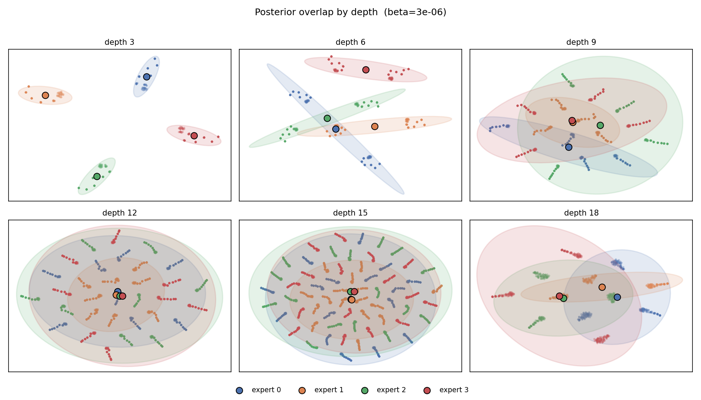
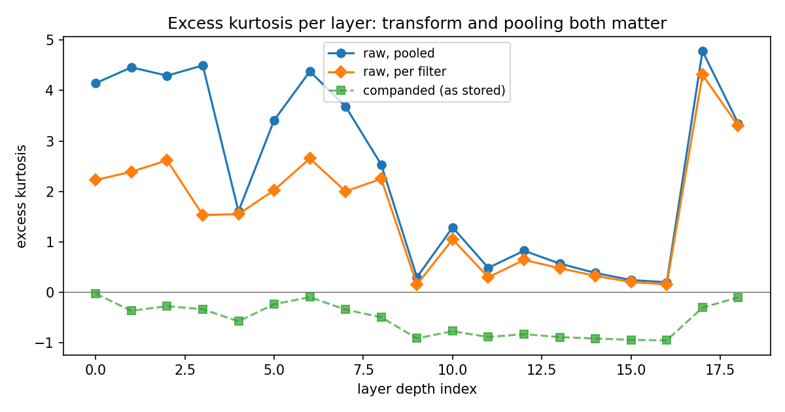
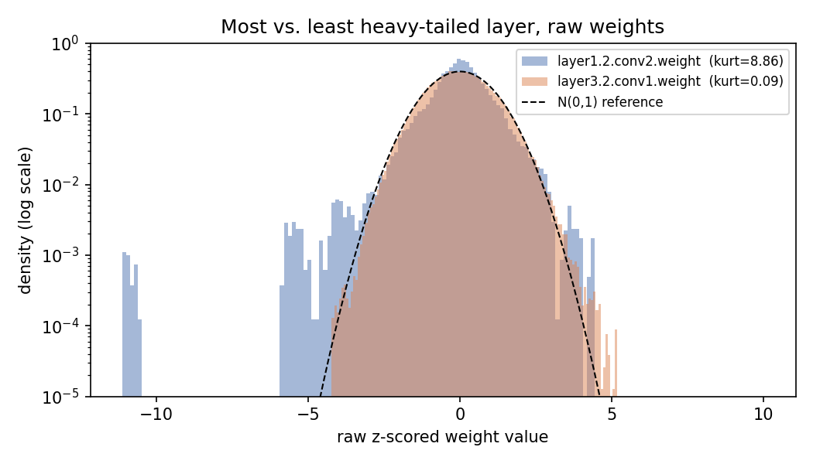
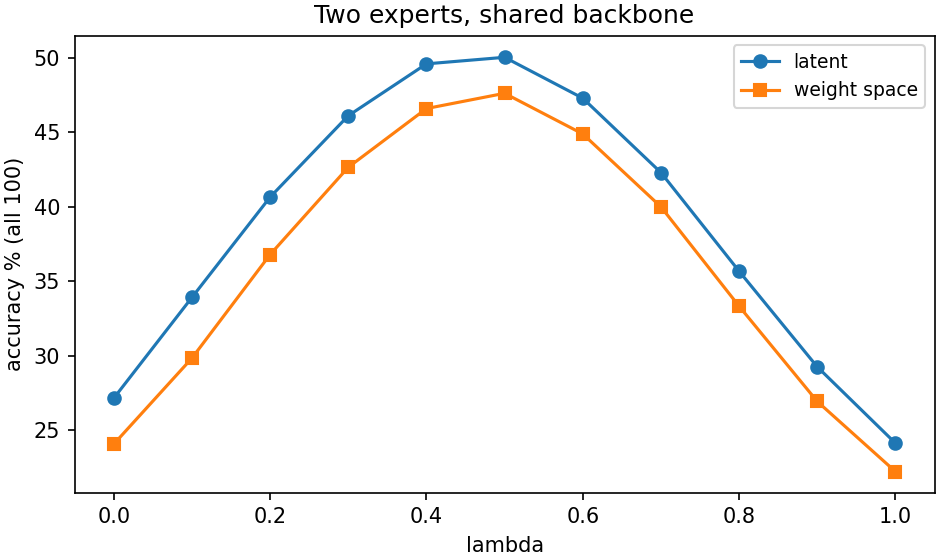
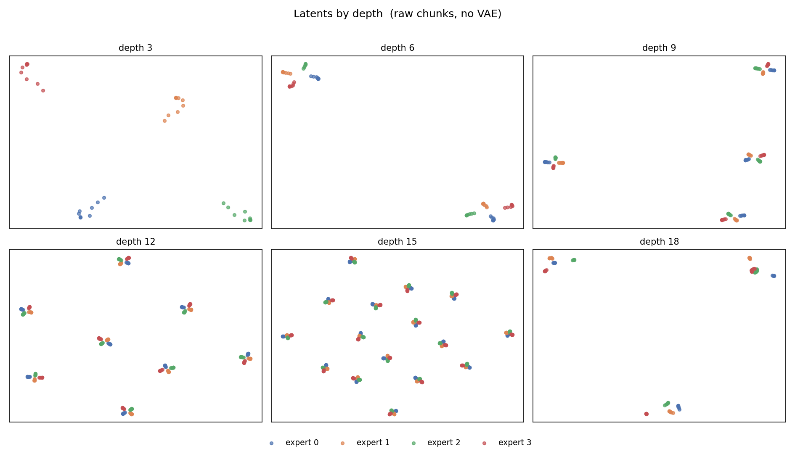
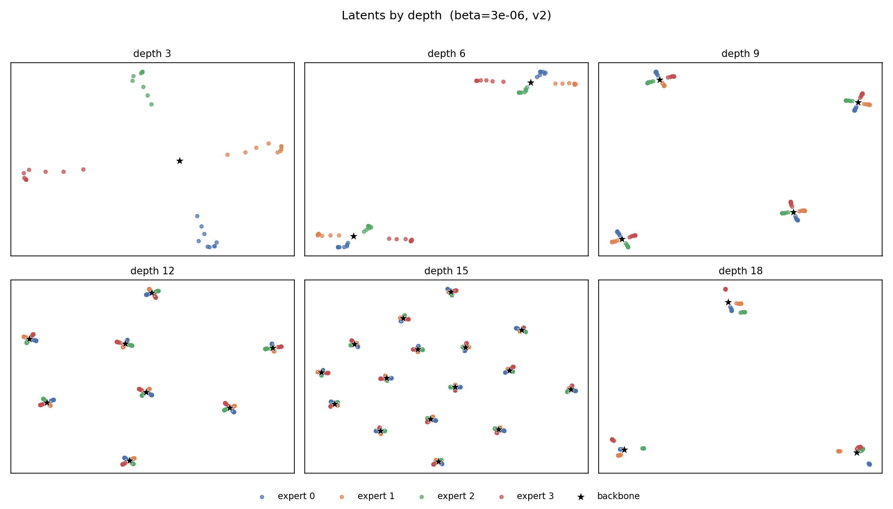
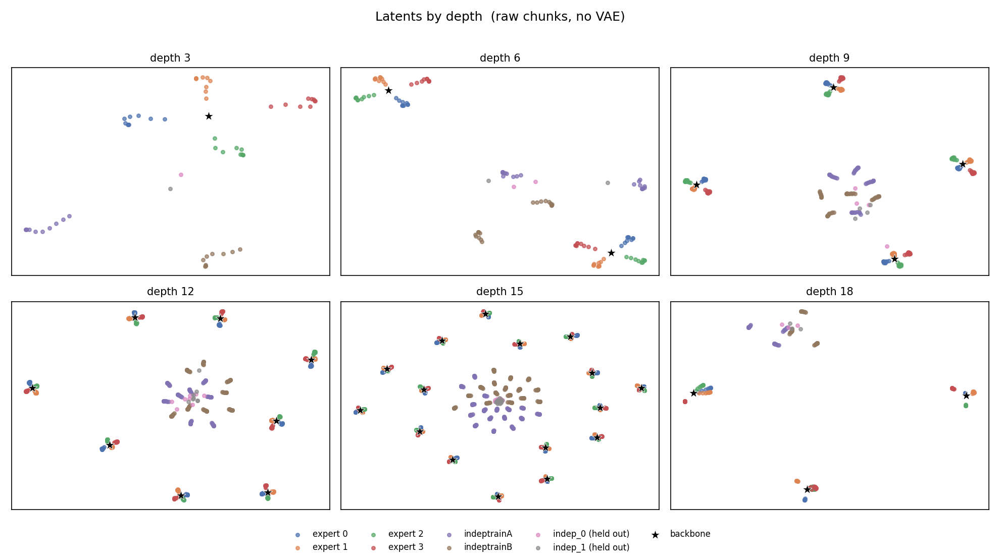
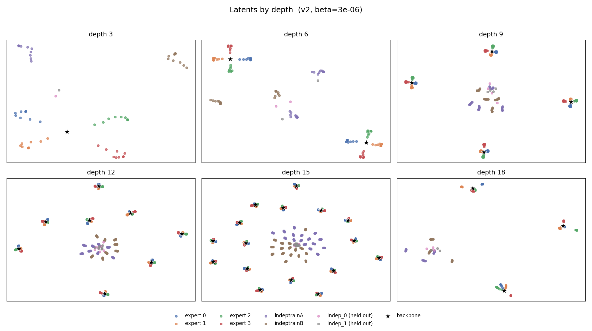
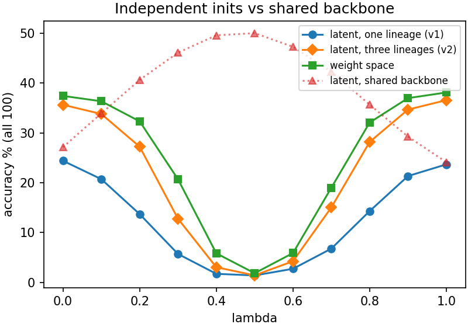
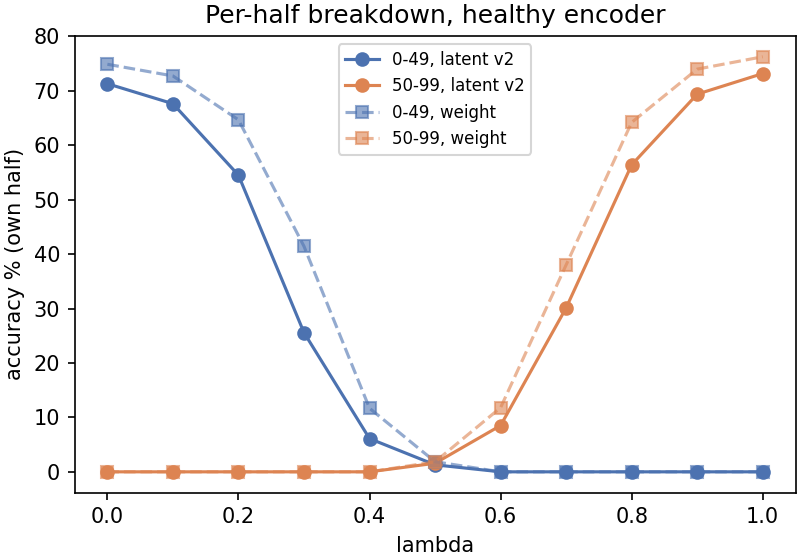

# From Experts to Strangers

**Latent-space model merging on ResNet-20, and where it stops working.**

Merging is the cheapest way to keep the investment in a trained network: fold several models
into one by arithmetic on their parameters, with no further training. The catch has always
been that the parents have to be close relatives. LS-Merge claims more: that if weights are
first encoded into a learned latent space, the operation stops caring what shape the models
are.

The released code for the paper stops at the encoder. There is no merging, no alignment, no
evaluation. So we built all of it ourselves, for ResNet-20 on CIFAR-100, an architecture the
paper never visits, and then pushed on the part the paper does not test: what happens when
the parents stop being relatives.

Everything below is a number we produced by running the code in this repository.

---

## What is in here

```
utils/        every module: the method itself
notebooks/    the five phases, in order, with their outputs kept
imgs/         the figures used in this README
```

`utils/` is an ordinary Python package, so everything imports as `from utils.chunking import ...`,
and the notebooks put the repository root on the path in their first cell.

| module | what it does |
|---|---|
| `utils/resnet20.py` | ResNet-20 for CIFAR, option-A shortcuts so every kept conv stays at `C_in ∈ {16,32,64}` |
| `utils/chunking.py` | the whole weight↔chunk chain: normalise, compand, pad, chunk, plus the manifest that inverts it |
| `utils/extract.py` | CLI wrapper around chunking, runs the three verification gates on one checkpoint |
| `utils/dataset.py` | `ResZoo`, one item = one sequence of 16 chunks; and the zoo split logic |
| `utils/transformer.py` | pre-norm transformer blocks with rotary position encoding |
| `utils/transformer_vae.py` | the encoder/decoder pair, depth and stage conditioning, masked β-VAE loss |
| `utils/reconstruction.py` | decode → load into a ResNet → recalibrate BatchNorm → evaluate |
| `utils/latent_analysis.py` | t-SNE grids by depth, expert separation, posterior overlap |
| `utils/permutation.py` | the permutation symmetry group of this network, and the gate that verifies it |
| `utils/alignment.py` | the Bures map, unit-level matching with Hungarian or Sinkhorn, and the descriptors both run on |
| `utils/weight_stats.py` | per-layer moments, tail mass, per-filter kurtosis, PCA spectra |
| `utils/cifar_eval_data.py`, `utils/constants.py` | evaluation loaders and the shared configuration |

| notebook | what it does |
|---|---|
| `notebooks/phase_one_generate_model_zoo.ipynb` | trains the backbone, the five experts, and the independent runs |
| `notebooks/phase_two_generate_and_analyze_dataset.ipynb` | chunks every checkpoint, then the weight-statistics study |
| `notebooks/phase_three_train_and_evaluate_weight_vae.ipynb` | trains the autoencoder, chooses β, reconstruction and PCA controls, retrains on three lineages |
| `notebooks/phase_four_merge_experts_in_latent_space.ipynb` | the merges: pairs, the five-way barycentre, and the independent-initialisation test |
| `notebooks/phase_five_alignment_and_ot.ipynb` | the permutation group, what the paper's OT does here, and align-then-merge |

The five notebooks run in order. Each one writes artefacts the next one reads, and nothing
after phase three regenerates a checkpoint.

---

## The architecture

### Chunking, and why 144

A weight tensor is flattened row-major, z-scored per layer in float64, companded with
`sign(x)·log1p(|x|)`, then cut into chunks of 144 values. Each chunk is a token.

144 is not arbitrary. Every kept convolution in ResNet-20 has `C_in ∈ {16, 32, 64}` and a
3×3 kernel, so a filter is `9·C_in` values, always a multiple of 144. No conv layer needs
padding, and token index *k* means the same sub-filter phase at every depth. The stem is
excluded because its filters are 27 values and do not divide; the classifier is included,
because our experts specialise by class and the head is where that shows. What remains covers
**98.8%** of the parameters, 19 layers, 1904 chunks per model.

Three gates run on every checkpoint before it can enter the zoo, and none of them may be
skipped: coverage (kept + excluded must account for every float), alignment (no conv may need
padding), and a round trip (rebuild the tensor and compare against the original, tolerance
1e-6). A corrupted manifest reaching the VAE costs days. Catching it here costs nothing.

### Encoder and decoder

Chunks are projected to 256 dimensions and summed with learned depth and stage embeddings, so
the model knows *where in the network* a chunk came from rather than treating all weights
alike. Four pre-norm transformer blocks with rotary encoding follow, then linear heads for μ
and log σ². The decoder mirrors this exactly, with its own depth and stage embeddings.
Latent dimension is 144, so the compression ratio is r = 1: no bottleneck at all. If
reconstruction still breaks a ResNet at r = 1, the fault is in the plumbing rather than in
compression, and we wanted that question settled before anything else.

The loss is a masked MSE, padding never enters it, plus βKL.

### Two stages, and choosing β

Training follows the paper's curriculum: a deterministic autoencoder first (β = 0, 200
epochs), then β-VAE fine-tuning from that checkpoint (50 epochs). One change at a time, so a
failure traces to a single cause.

We swept β over seven values. The statistic that decides it is *overlap*: between-expert
distance measured in units of the encoder's own posterior spread, read at the classifier.
Below 1 means two experts sit inside each other's uncertainty and there is nothing distinct
left to merge.

| β | val. recon. | posterior σ | overlap at `fc` |
|---|---|---|---|
| 0 | 0.00204 | 0.151 | 19.933 |
| 1e-6 | 0.00183 | 0.532 | 6.444 |
| **3e-6** (chosen) | **0.00184** | **0.954** | **3.735** |
| 6e-6 | 0.00186 | 1.424 | 2.583 |
| 9e-6 | 0.00188 | 1.815 | 2.061 |
| 1e-5 | 0.00189 | 1.936 | 1.941 |
| 1e-4 | 0.00250 | 8.485 | 0.493 |

β = 3e-6 ties for the best validation reconstruction, its posterior lands at σ ≈ 1, which is
essentially the prior, and the experts stay separable at the head. Past 9e-6 the overlap
drops below 1 and they stop being distinguishable.

One detail worth stating because it contradicts the usual story: at β = 0 the posterior
collapses to σ = 0.15, *tighter* than the prior. KL then widens it rather than narrowing it.
That is the opposite of the posterior-collapse regime the paper discusses, and it is why β
here is six orders of magnitude smaller than a typical image VAE.



*Experts separate cleanly at shallow depth and are swallowed by their own posteriors by depth
15. That is why the overlap statistic is read at the classifier rather than averaged over
depth.*

### Merging

Merging two models interpolates their latents, `z_λ = (1−λ)z_a + λz_b`, and decodes. For N
models it is the uniform barycentre. BatchNorm running statistics are properties of the
weights and the data together, so they are invalid the moment any weight changes: we reset and
recalibrate them after every merge, for every method alike, including the weight-averaging
baseline. Skipping that on one arm and not the other is the easiest way to manufacture a
result.

### The error bar

Interpolating between two posterior *samples of the same model* gives accuracies between
22.56 and 22.76, a spread of 0.20 points, with per-point standard deviations of 0.01 to 0.04.
This is a null result and we report it as one: it fixes the evaluation noise floor, driven by
BatchNorm recalibration, and it is the error bar on every merge number below.

---

## The weights themselves

The paper motivates its encoder with heavy-tailed weight distributions. On ResNet-20 that is
true, but only if you measure it correctly, and there are two ways to get it wrong.



| measurement | mean excess kurtosis |
|---|---|
| as stored (companded) | −0.535 |
| raw, pooled per layer | +2.393 |
| raw, per filter | +1.590 |

Measured on the companded values, which is how the released pipeline stores weights, the
layers are *platykurtic* at almost every depth, and the motivation appears to evaporate.
Inverting the transform brings the tails back. Pooling across filters of different scale then
inflates the statistic by a further +0.803 on average, because a layer of Gaussian filters
with unequal norms has positive pooled kurtosis and zero per-filter kurtosis. Only the
per-filter number is evidence of real tails. It is still clearly positive, so the design
argument survives, it just needs to be measured before storage and inside a filter.



The isolated mass near z = −11 on the left is a single weight in `layer1.2.conv2`. It is
stable to 2% across all 27 expert checkpoints, so it is structure rather than noise, and we
use it throughout as a tail-preservation test. An autoencoder that reconstructs the bulk and
smooths that weight away has not really reconstructed the network.

---

## Results

### Siblings merge beautifully

We train one backbone on all 100 classes to **68.79%**, then fork five experts, each
fine-tuned on a disjoint 20-class subset. Each reaches about 86% on its own classes and 5%
elsewhere, roughly 21.7% overall. These are the paper's own conditions: one initialisation,
pulled apart in complementary directions.

The uniform barycentre of all five reaches **67.24%**, 98% of the backbone, from parents that
each know a fifth of the label space. Every group survives, between 65.6 and 68.5, so this is
a real combination and not a collapse onto one parent.



And here is the number that keeps us honest. Weight averaging, the baseline all of this is
supposed to improve on, reaches **67.21%**. A tie, well inside the 0.20-point error bar. For
two experts the latent margin looks wider, 48.72 against 46.48, but 3.10 of those points are
already present at λ = 0, before anything is merged: passing a model through the autoencoder
blurs it slightly, and a blurred specialist scores a little better on classes it was never
supposed to know. That is smoothing drift, not merging. Quote λ = 0.5 without λ = 0 and you
get free points that have nothing to do with the method.

Inside the basin, the latent space matches averaging without beating it. The interesting
question is what happens when we leave it.

### What reconstruction costs

| method | r | own | all | mean rel. err. | tail weight |
|---|---|---|---|---|---|
| original | n/a | 82.50 | 22.66 | n/a | n/a |
| VAE, v1 | 1.0 | 82.00 | 25.24 | 0.0809 | 11.6% off |
| VAE, v2 | 1.0 | 82.35 | 22.73 | 0.0221 | 1.3% off |
| PCA | 1.6 | 63.53 | 13.35 | n/a | n/a |
| PCA | 2.0 | 48.17 | 9.73 | n/a | n/a |
| PCA | 4.0 | 12.90 | 2.58 | n/a | n/a |

A held-out expert gives up **0.15 points** of own-class accuracy at 0.022 relative error. A
linear baseline at matched compression gives up 19, and by r = 4 there is nothing working
left. The 11σ weight comes back to within **1.3%**. So the transformer is doing something a
linear method cannot: it preserves the rare, large coordinates that carry a specialist's
behaviour, and it does so while compressing (v2's validation KL is 1155 against v1's 2849 on
identical batches).

Note the `all` column for v1: 25.24 against an original of 22.66. That +3.35 is the smoothing
drift again, and it is why v2, which reconstructs faithfully enough that the inflation drops
to +0.07, is the encoder we trust for anything quantitative.

### The encoder had never met a stranger

Leaving the basin turned out to be harder than expected, for a reason that had nothing to do
with merging.

Handed a ResNet-20 trained from an independent seed, same architecture, same data
distribution, different initialisation, the first encoder simply failed. Relative error rose
from 0.081 to 0.40, the 11σ weight came back 11.6% wrong, and the decoded network lost 26
accuracy points. Any permutation experiment run on top of that is unreadable: you cannot tell
whether merging failed because of misalignment or because the encoder never learned what an
unrelated network looks like.

| encoder | in-dist. | indep. seeds | tail | acc. lost |
|---|---|---|---|---|
| v1 (1 lineage) | 0.081 | 0.404 / 0.399 | 11.6% | −26 / −27 |
| v2 (3 lineages) | 0.022 | 0.110 / 0.091 | 1.3% | −3.6 / −2.5 |

The remedy was data, not architecture. We added 20 checkpoints from two ResNet-20 runs
trained from scratch on disjoint label halves, never merge subjects, so nothing leaks, and
retrained the same encoder unchanged. Out-of-lineage error fell fourfold, the tail returned to
its in-distribution accuracy, and the penalty dropped from 26 points to 3.6. The encoder even
improved *in* distribution, from 0.081 to 0.022.

This is a blind spot in the paper's design rather than an oversight on its part. Its
generalisation study moves family and architecture together, from Gemma to LLaMA, but never
the initialisation alone at fixed architecture, and that is the variable which decides
whether two networks can merge at all. Among pretrained LLMs that experiment is barely
available. On ResNets it costs an afternoon.

### The latent is a copy of weight space

If latent merging is going to beat weight arithmetic, the latent has to be geometrically
different from weight space. So we measured between-expert separation in the latent,
normalised by the norm at each depth, against the same quantity computed on raw chunks. A
ratio of 1 means the encoder reproduced the structure the weights already had.

| encoder | latent dim. | β | geometry ratio |
|---|---|---|---|
| raw weights (reference) | n/a | n/a | 1.000 |
| v1 | 144 | 3e-6 | 0.832 |
| v2 | 144 | 3e-6 | 0.712 |
| expanded | 720 | 3e-6 | 0.883 |

It never exceeds 1. Better encoders contract more, which is exactly what a reconstruction
objective rewards. The pictures say the same thing more bluntly:




Raw chunks on top, v2 latents below. They are near-identical.

Extend the same control to the from-scratch lineages and the point sharpens:




Expert checkpoints form rosettes around the backbone at every depth; the independently
initialised runs sit in a separate central cloud. In the raw chunks *and* in the latents. The
encoder does not bring strangers closer together.

### The stricter test

Two ResNet-20s trained from scratch with different seeds are relabellings of one another, and
averaging them element-wise adds unrelated filters together. It collapses from 69% to
**1.72%** at λ = 0.5. Latent merging falls with it.




The v2 curve is the one to read: the endpoints are healthy now, so the hole in the middle is
not the encoder failing to reconstruct. It is the merge itself. The per-half breakdown shows
what the aggregate hides, each parent's own half decays smoothly toward zero and nothing
takes over in between. Nothing is being combined; one model is being destroyed and replaced
by the other.

### Alignment does not rescue it

Phase five separates two things that both travel under the name optimal transport. The
paper's OT is a per-layer Gaussian, or Bures, map: one affine whitening and recolouring
applied identically to every chunk, which repairs support mismatch between separately
trained encoders and different architectures. Unit-level OT is a discrete coupling between
the filters of two models, a cost matrix solved with Hungarian or Sinkhorn, which is what
OTFusion and Git Re-Basin do. Only the second is about permutations, and the reason is
structural rather than empirical. Write a layer's latents as `Z`. The Bures map is
`Z ↦ (Z − μ_s)Aᵀ + μ_t`, right multiplication, acting on coordinates. A permutation is
`Z ↦ PZ`, left multiplication, acting on the set of units. No choice of `A` reorders rows.

We measured that rather than asserting it, and the paper's map cannot see the problem it
would need to fix:

| comparison | ‖A−I‖/√d |
|---|---|
| model vs. itself | 0.0000 |
| its own latents, rows shuffled | 0.0000 |
| a permuted copy of itself (functionally identical) | 0.7040 |
| a different seed (genuinely different) | 0.7046 |

Rows three and four differ by 0.0006, yet one pair is functionally the same network and the
other is not. Row two is the reason: an affine map acts on coordinates while a permutation
acts on the sample index, so reordering the rows of a distribution leaves the map unchanged.
The map is measuring the wrong thing.

Explicit permutation matching does better, and still not well:

| alignment | same data, diff. seed | disjoint halves |
|---|---|---|
| endpoints (λ ∈ {0,1}) | 68.99 / 69.40 | 37.44 / 38.13 |
| none | 1.72 | 1.85 |
| weight, full (Re-Basin style) | 5.38 | 2.45 |
| weight, rows | 3.49 | 2.51 |
| latent matching | 2.38 | 2.30 |
| latent + Bures OT | 1.28 | not run |

It lifts the midpoint by 3.66 points when the parents saw the same data, and by 0.60 when they
did not, where all three methods land within 0.2 of each other. Matching recovers a
relabelling. It does not reconcile two models that learned different things. (The permutation
machinery itself was verified separately at 100% planted-permutation recovery in all three
modes, with Hungarian and Sinkhorn agreeing, so this is a result and not a broken solver.)

Two things had to be right before any of those numbers meant anything. First, the group.
Option-A shortcuts constrain which permutations are symmetries of this network at all: the
zero-padded shortcut pins the middle of each residual stream to the stream below, so only
twelve permutations are free, and a matcher that solves the streams independently produces
a model that loads without complaint and predicts noise. Every permutation here is built
inside that group and checked, and a random one has to leave the logits untouched before
anything is matched. Second, iteration. A filter's descriptor is not invariant to the
permutation of the layer below it, because the filter is laid out in input-channel order,
so descriptors must be recomputed against the current alignment and the match re-solved.
One shot recovers well under half of a planted permutation; iterating recovers all of it.
A latent code inherits exactly the same non-invariance, which is a small result of its own:
a permutation-invariant weight encoder would have to address that directly.

---

## What we conclude

The pieces fit together into one story. Latent merging ties weight averaging inside a basin
because the encoder reproduces weight-space geometry instead of improving on it, the
geometry ratio never exceeds 1, and the t-SNE grids are near-identical. It fails outside a
basin because the obstruction there is a discrete correspondence between hidden units, which
neither an interpolation in latent space nor an affine transport map can express. And between
those two facts sits the encoder, which does not generalise across initialisations until it
has been shown more than one, something no LLM-only evaluation can reveal, because the
experiment is not available there.

None of this contradicts the paper. Its merges cross model families, where weight arithmetic
is not merely worse but unavailable. The benefit is *reach*, not a kinder space to interpolate
in. That is a narrower claim than "shape stops mattering", and it is the one our numbers
support.

Two limitations are worth stating plainly. ResNet-20 is narrow, and narrow networks lack the
permutation freedom to align well, so our alignment results are a conservative reading of what
matching can do on wider architectures. And our validation split holds out a training
trajectory rather than an initialisation, so β was selected against in-lineage reconstruction
and may not be optimal for out-of-lineage encoding.

---

## Running it

Requirements: PyTorch, torchvision, numpy, scipy, scikit-learn, matplotlib, tqdm. A single
GPU is enough; the backbone is the longest job at 200 epochs.

Before the first run, edit `utils/constants.py`: `IMG_PATH` points at an absolute path for
saved figures, and `ZOO_PATH` defaults to `./zoo_chunks`. CIFAR-100 is loaded with
`download=False`, so put it in `./res_data/` first.

Then run the notebooks in order. Every path inside them is relative to the repository root,
and the first cell of each notebook chdirs there and puts it on `sys.path`, so it does not
matter whether you start Jupyter from the root or from `notebooks/`.

1. **Phase one** trains the backbone (`res_models/backbone_a.pt`), forks five experts with a
   checkpoint every 4 epochs (`res_models/expert{k}_seed1246/`), and trains four
   from-scratch models: `indep_0` and `indep_1`, which stay untouched as merge subjects, and
   `indeptrainA`/`indeptrainB`, which exist to give the autoencoder extra lineages.
2. **Phase two** chunks everything into `zoo_chunks/`, `zoo_reference/` and
   `zoo_independent/`, running the three gates on every checkpoint, and does the
   weight-statistics study.
3. **Phase three** trains the autoencoder, sweeps β, runs the reconstruction and PCA
   controls, and then retrains on three lineages as v2.
4. **Phase four** does the merges.
5. **Phase five** builds the permutation group and its symmetry gate, measures how far the
   paper's Bures map is from the identity between two models of the same architecture, and
   then aligns before merging, comparing Git Re-Basin against unit-level OT on latent and
   on raw-weight descriptors.

You can also chunk a single checkpoint from the shell, which is the quickest way to check the
pipeline end to end:

```bash
python -m utils.extract ./res_models/backbone_a.pt out_backbone/ \
    --model-id backbone_a --split-id full --seed 0 --epoch 198 --init-group base_a
```

Run it from the repository root, as a module: the package uses relative imports, so
`python utils/extract.py` will not find its siblings. The same holds for
`python -m utils.weight_stats <checkpoint>`.

Expect 19 layers, 1904 chunks, 98.8% coverage, and a round-trip error below 1e-6.

**On the splits.** Experts 0 to 2 train the autoencoder, expert 3 validates, expert 4 is held out
entirely, and the five final (epoch 40) checkpoints are the merge subjects and never appear in
training. Whole experts are held out rather than scattered checkpoints, because consecutive
epochs within one trajectory are near-duplicates and splitting inside a trajectory would not
hold anything out. `summon_res_zoo` asserts all three disjointness conditions; those
assertions are what catch a silent contamination bug before it reaches the VAE.

**One note on the checked-in outputs.** The cell outputs stored in the notebooks come from an
earlier run of the same pipeline, so a few of them differ in the second decimal from the
numbers quoted above, which are from the final run. The code is the same; rerun the notebooks
and you will reproduce the table values here.

---

## Reference

Soro, Zhang, Andreis, Jo, Chong and Hwang, *LS-Merge: Merging Language Models in Latent Space*, ICLR 2026 ([OpenReview](https://openreview.net/forum?id=VSDV0SWwOC)). This repository implements
the ResNet side of that method, chunking, conditioning, the model zoo, merging, alignment and
the whole evaluation, none of which ships with the paper, and extends it with the
across-initialisation experiments the paper does not run.

The written report, with the full derivation of the results above, is in the accompanying
paper; the figures in `imgs/` are the ones it uses.
